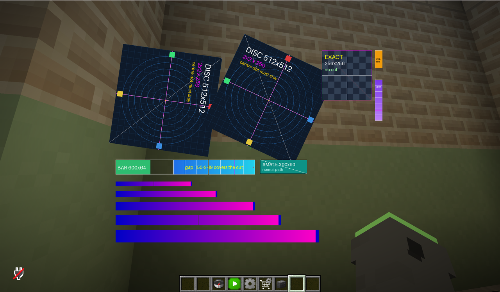

# image splitting

BetterHud draws an image as one glyph of a Minecraft bitmap font: one texture, one codepoint, one
quad. That works until the image grows past the size of the font atlas.

## Why 256 is the ceiling

The client stitches every glyph of a font into a **256x256 sheet**
(`net.minecraft.client.gui.font.FontTexture`), and the quadtree which places a glyph on that sheet
refuses anything wider or taller than the sheet itself (`FontTexture.Node.insert`). A bitmap provider
whose cell does not fit is silently dropped and the client draws the missing-glyph box instead - so an
image of **more than 256 pixels in either direction** just disappears from the hud, with no error on
either side.

```yaml
images:
  map:                            # 512 x 512
    file: hud/map.png
    type: single
```

Before, that image was drawn as an empty box. Now it loads.



## What happens instead

The cut is automatic; nothing has to be configured:

1. while the configuration is parsed, an image bigger than 256 px in either direction is cut into a
   grid of tiles of at most 256 x 256 px, and only the tiles are written into the resource pack;
2. every tile is registered as a glyph of the hud's own font, exactly like the untouched image was;
3. the glyphs are put back together so that they land on the rectangle the original image would have
   occupied.

The cut lines are **rounded once each**, never accumulated tile by tile, so two neighbours share the
same edge and cannot drift apart by a rounding error.

The grid is uniform: the tiles at the right and bottom edge are padded with transparency so that every
tile has the same cell size. That is not cosmetic - the client scales a bitmap glyph by
`json height / cell height`, so a tile which is one pixel shorter than its neighbours would be drawn at
a slightly different scale, and the pieces would not line up.

### Why the cell width is a multiple of the cell height

The client draws a tile `cellWidth * jsonHeight / cellHeight` pixels wide
(`BakedGlyph.getPixelWidth / getOversample`), while the cursor which puts the tiles next to each other
only moves by whole pixels: vanilla derives a bitmap glyph's advance as
`(int)(0.5 + visibleWidth * scale) + 1` (`BitmapProvider.Definition.getActualGlyphWidth`), an integer.

So unless that product is a whole number the two disagree by a fraction of a pixel at **every column
boundary** - a hairline seam running through the picture, or a row of pixels of the background showing
through it. It is the same rounding vanilla does between two neighbouring glyphs, but a seam *inside*
one picture is far easier to see than a seam between two elements.

Cutting into cells whose width is a multiple of their height makes the product
`(cellWidth / cellHeight) * jsonHeight` whole for **every** JSON height, i.e. for every scale, at no
cost beyond transparent padding on the right of the last column. That padding is trimmed off the
element again with one more space glyph, so the element still reports - and is positioned and rotated
by - the size the untouched image would have had.

A single-column cut (an image which is only too tall) is deliberately left alone: it has no seam to
leave, and its one column only meets whatever follows the element, where vanilla rounds the same way.

An image which already fits is left alone: it keeps its own texture and its own font entry, and the
generated pack stays byte for byte what it was.

## How the pieces are put back

An image is one `WidthComponent` (a run of glyphs, one x offset) and the hud positions it with space
glyphs. Both axes are already spoken for, so the tiles use them:

* **y** - every tile carries its own ascent, which is `element y + the tile's own y`. The vertex
  shader turns that ascent back into a pixel offset, so the tiles stack on top of each other;
* **x** - after every tile a space glyph pads the cursor to the tile's right edge, and every row ends
  with a negative space which rewinds the cursor to the left edge of the image.

The padding is needed because the vanilla provider derives the advance of a glyph from the **last
column of the tile which contains anything** (`BitmapProvider.Definition.getActualGlyphWidth`), not
from the tile's width: a tile which ends with transparency would advance too little, and the next tile
would be drawn on top of it. BetterHud mirrors that computation while it cuts, so
`advance + padding == the tile's width` holds for every tile.

## Rotation and clipping

A turning (or clipped) element pivots around **its own centre**, and a single tile cannot know where
that is: with one shader shared by all of them every piece would turn around its own centre and the
picture would tear apart.

A tile of such an element therefore gets a shader of its own, whose half-size is the tile's and which
carries the offset from the tile's centre to the element's (`bhRotAnchor`). The pieces turn, and clip,
around one shared point - the centre of the whole image.

Elements which do not turn keep a single shader for all of their tiles, so a pack without rotation has
exactly the shader it had before.

## Limits

* **The pack no longer carries the whole image** when it is cut - only the tiles are written, which is
  what the client downloads either way. Nothing else refers to that texture name;
* **Compass images are not covered yet.** A compass image is replicated up to `length / 2` times (once
  per opacity and scale step), so cutting one image there means cutting all of its copies; that is a
  separate change;
* **Text backgrounds are not covered yet** (`backgrounds/`), they have their own loader;
* The vertical travel of an element is still bounded by the `ascent` encoding (about 16000 pixels), so
  an extremely tall image is limited by the shader rather than by the atlas.

## Verified in game

1.21.4, 1.21.8, 1.21.11 and 26.2, on both the OpenGL and the Vulkan backend: at every scale the
pieces line up, a rotating one turns as a single picture, and the shader compiles on each of them.
